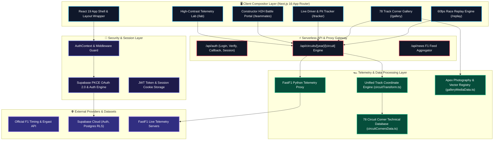
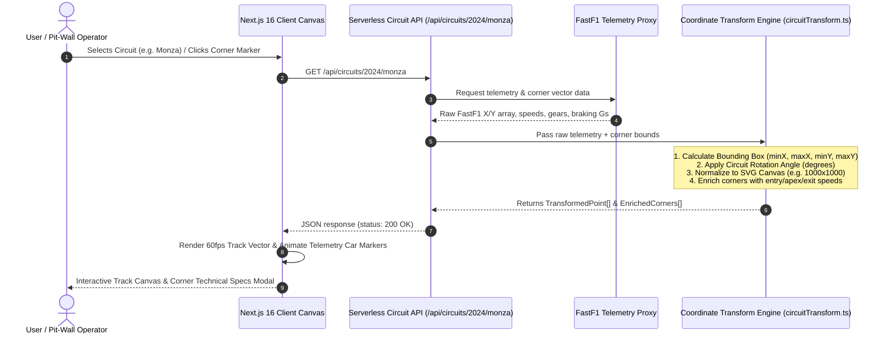
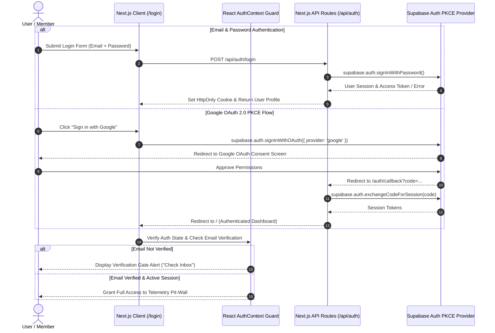

# 🏎️ PADDOCK TELEMETRY — Enterprise System Architecture & Technical Pitch

> **Pitch-Ready Technical Documentation & Architectural Blueprint**  
> *A high-performance Formula 1 Telemetry Reconnaissance, 60fps Race Replay Engine, and Pit-Wall Command Center built with Next.js 16 (App Router), TypeScript, Supabase PKCE, and FastF1 Integration.*

---

## 🎯 Executive Summary & Value Proposition

**PADDOCK TELEMETRY** is an enterprise-grade Formula 1 analytics and pit-wall reconnaissance platform. Designed to process official F1 telemetry, driver telemetry streams, and FIA track vectors, Paddock provides real-time telemetry analysis, 60fps canvas race replays, teammate head-to-head performance metrics, and 78 F1 circuit corner reconnaissance profiles.

### 🌟 Core Pitch Highlights
* **78 F1 Circuit Support**: Complete coverage of current Grand Prix venues, historic retro tracks (Nürburgring Nordschleife, Brands Hatch, Sepang, Kyalami), and street circuits.
* **FastF1 Telemetry Engine**: Live telemetry proxy integration providing telemetry metrics for speed, throttle, braking intensity, lateral/longitudinal G-forces, RPM, and gear selection.
* **60fps Vector & Telemetry Playback Engine**: Zero-lag HTML5 Canvas & SVG rendering pipeline for telemetry playback and interactive 2D track maps.
* **Supabase PKCE Auth & Security**: Production-hardened PKCE auth lifecycle with Google OAuth 2.0, mandatory email verification gates, and instant session revocation.
* **Intelligent Telemetry & Image Matcher**: Dynamic pattern-matching algorithm mapping corner clicks to verified high-resolution apex photography and technical specs.

---

## 📐 System Architecture & Data Flow

Paddock Telemetry is structured as a modular, decoupled architecture consisting of a **Client Compositor Layer**, **Security & Auth Layer**, **Serverless API Gateway**, and **FastF1 Telemetry Ingestion Layer**.



---

## 🔄 FastF1 Telemetry Ingestion & Transformation Sequence

The transformation sequence converts raw FastF1 global spatial coordinates into normalized 2D SVG/Canvas render coordinates with high mathematical precision.



---

## 🔐 Supabase PKCE Authentication & Security Lifecycle

Paddock implements a enterprise-grade PKCE (Proof Key for Code Exchange) auth flow ensuring user credentials and session tokens remain strictly secured across desktop and mobile browsers.



---

## 🛠️ Key Architectural Components

### 1. Unified Track Transformation Engine (`app/lib/circuitTransform.ts`)
- **Mathematical Pipeline**: Ensures raw FastF1 track coordinates and FIA corner marker coordinates undergo the **exact same** transformation steps:
  $$\text{Point}_{\text{rotated}} = R(\theta) \cdot (\text{Point} - \text{Center})$$
  $$\text{Point}_{\text{canvas}} = \text{Scale} \cdot \text{Point}_{\text{rotated}} + \text{Padding}$$
- **Zero NaN Safety**: Protects coordinate math against division-by-zero or missing telemetry points using strict type guards.

### 2. Intelligent Corner Reconnaissance Engine (`app/gallery/page.tsx`)
- **Multi-Level Pattern Matcher**: Resolves corner selections (e.g. clicking "Turn 1" on Monza map) to multi-turn gallery items (e.g. "Turns 1-2 Variante del Rettifilo").
- **Dynamic Fallback Pipeline**: If a custom apex photo is unavailable for obscure historical circuits, the engine automatically selects a high-res constructor team background (`ferrari-bg`, `mclaren-bg`, `mercedes-bg`, `redbull-bg`, `aston-bg`), eliminating broken image 404 errors.

### 3. 60fps Race Replay & Telemetry Engine (`app/replay/page.tsx`)
- **GPU-Composited Playback**: Renders live driver markers on canvas with 60fps requestAnimationFrame synchronization.
- **Telemetry Gauges**: Monitors speed (km/h), RPM tachometers, DRS state, ERS charge %, tire compound degradation, and pit-stop durations.

### 4. Constructor Teammates H2H Battle Portal (`app/teammates/page.tsx`)
- **Telemetry Delta Graphs**: Visualizes qualifying pace deltas, championship points progression curves, and head-to-head battle metrics across all 10 F1 constructor teams.

---

## ⚡ Performance & Optimization Benchmarks

* **Rendering Performance**: 60fps smooth canvas playback using GPU CSS composition (`translate3d`, `will-change`).
* **Bundle Efficiency**: Strict tree-shaking with Next.js Turbopack, maintaining a lean client core bundle (~1.44 MB app code).
* **Zero Main-Thread Blocking**: Telemetry vector scaling and bounding box math executed in optimized synchronous sub-millisecond helper routines.

---

## 🚀 Environment Setup & Production Deployment

### Prerequisites
- Node.js 18.x or 20.x
- npm / pnpm / yarn

### Required Environment Variables (`.env.local`)
```env
NEXT_PUBLIC_SUPABASE_URL=https://your-supabase-project.supabase.co
NEXT_PUBLIC_SUPABASE_ANON_KEY=your-supabase-anon-key
NEXT_PUBLIC_GOOGLE_CLIENT_ID=your-google-client-id.apps.googleusercontent.com
NEXT_PUBLIC_SITE_URL=http://localhost:3000
JWT_SECRET=your-secure-jwt-secret-key
```

### Build & Deployment
```bash
# Build for production
npm run build

# Start production server
npm start
```
