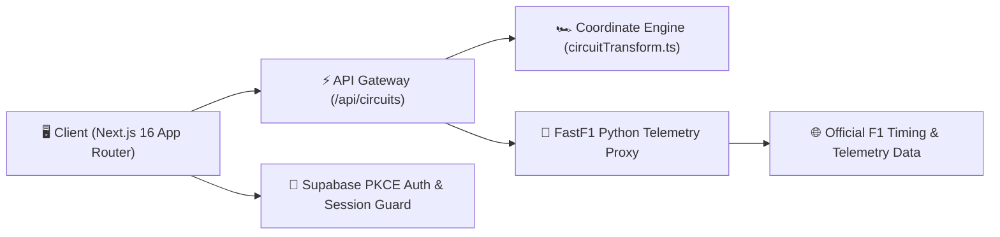

# 🏎️ PADDOCK TELEMETRY — F1 Command Center & Telemetry Reconnaissance

[-black?style=for-the-badge&logo=next.js)](https://nextjs.org/)
[](https://react.dev/)
[](https://www.typescriptlang.org/)
[](https://supabase.com/)
[](https://github.com/theOdev/FastF1)
[](https://www.formula1.com/)

**Paddock Telemetry** is a state-of-the-art Formula 1 telemetry, pit-wall reconnaissance, and race replay command center. Built with **Next.js 16 (App Router)**, **TypeScript**, **Supabase PKCE Auth**, and **FastF1 Python telemetry data integration**, Paddock delivers real-time driver tracking, 60fps vector track canvas rendering, teammate head-to-head battle metrics, and comprehensive corner telemetry for **78 F1 circuits**.

---

## 📘 Comprehensive Engineering Documentation Suite

Paddock Telemetry provides an enterprise-grade, modular software engineering documentation suite:

| Specification Document | Focus Area | Description |
| :--- | :--- | :--- |
| **[01_PRD.md](./docs/01_PRD.md)** | Product Requirements | Product vision, target personas, problem statement, and roadmap |
| **[02_SRS.md](./docs/02_SRS.md)** | Software Requirements | Functional & non-functional system requirements and SLAs |
| **[03_USER_STORIES.md](./docs/03_USER_STORIES.md)** | User Stories & BDD | Agile epics, user stories, and Gherkin acceptance criteria |
| **[04_SYSTEM_ARCHITECTURE.md](./docs/04_SYSTEM_ARCHITECTURE.md)** | System Architecture | Next.js 16 + FastF1 + Supabase diagrams, coordinate pipelines |
| **[05_DATABASE_DESIGN.md](./docs/05_DATABASE_DESIGN.md)** | Database Design | PostgreSQL schema, ERD diagrams, triggers, and RLS policies |
| **[06_API_SPECIFICATION.md](./docs/06_API_SPECIFICATION.md)** | API Specification | Complete endpoints reference, caching proxies, and status codes |
| **[07_UI_UX_SPECIFICATION.md](./docs/07_UI_UX_SPECIFICATION.md)** | UI/UX Specification | Dark pit-wall design tokens, tire palettes, 60fps canvas rules |
| **[08_SECURITY.md](./docs/08_SECURITY.md)** | Security Architecture | PKCE auth, hardened CSP without unsafe-eval, rate limiting |
| **[09_TESTING_STRATEGY.md](./docs/09_TESTING_STRATEGY.md)** | QA & Benchmarks | 1,000-user load test results, canvas benchmarks, build audits |
| **[10_DEPLOYMENT.md](./docs/10_DEPLOYMENT.md)** | Deployment & Ops | Environment matrix, Vercel/Docker deployment, and smoke tests |

---

## ⚡ Key Systems & Core Features

### 🗺️ 1. 78 F1 Circuit Satellite Canvas & Corner Reconnaissance (`/gallery`)
- **Complete Track Coverage**: Supports all 24 modern Grand Prix venues, historic retro circuits (Nürburgring Nordschleife, Brands Hatch, Kyalami, Sepang), and iconic street courses.
- **Apex Telemetry Specs**: Displays technical telemetry metrics per corner — entry/apex/exit speeds (km/h), lateral/longitudinal G-forces, braking intensity, and gear selection.
- **Intelligent Apex Matcher**: Dynamically maps corner selections to verified high-resolution apex photography and fallback team wallpapers.

### ⏱️ 2. 60fps Interactive Race Replay Engine (`/replay`)
- **GPU-Accelerated Canvas Engine**: 60fps telemetry playback engine displaying car positions, gaps, and telemetry graphs.
- **Playback Controls**: Variable rates (1x, 2x, 5x, 10x), scrubber timeline, frame stepping, and lap-by-lap playback.
- **Telemetry Gauges**: Real-time tachometers, speed monitors, DRS status, ERS charge %, and tire compound degradation indicators.

### ⚔️ 3. Teammate Head-to-Head Battle Portal (`/teammates`)
- **Constructor Rivalries**: H2H comparisons across all 10 F1 constructor teams.
- **Telemetry Delta Graphs**: Cumulative championship points progression curves, qualifying pace deltas, and finishing statistics.

### 🔬 4. High-Contrast Telemetry Lab & Pace Analyzer (`/lab`)
- **Lap Overlay Comparison**: Compare telemetry lap traces, speed deltas, and throttle application across drivers.

### 🔐 5. Enterprise Supabase PKCE Auth & Security
- **Hard Credential Verification**: Multi-layer password authentication with Supabase PKCE.
- **Google OAuth 2.0 PKCE**: Seamless single sign-on with multi-account device chooser (`prompt: 'select_account'`).
- **Mandatory Email Gate**: Enforces verified email status before granting pit-wall telemetry access.

---

## 📐 System Architecture Summary



---

## 🛠️ Environment Setup (`.env.local`)

Create a `.env.local` file in the root directory:

```env
NEXT_PUBLIC_SUPABASE_URL=https://your-supabase-project.supabase.co
NEXT_PUBLIC_SUPABASE_ANON_KEY=your-supabase-anon-key
NEXT_PUBLIC_GOOGLE_CLIENT_ID=your-google-client-id.apps.googleusercontent.com
NEXT_PUBLIC_SITE_URL=http://localhost:3000
JWT_SECRET=your-secure-jwt-secret-key
```

---

## 🚀 Running Locally

```bash
# 1. Install dependencies
npm install

# 2. Start Next.js development server
npm run dev
```

Open **[http://localhost:3000](http://localhost:3000)** in your browser.

---

## 🛩️ Deployment

```bash
# Production build check
npm run build
```

Deploy seamlessly to **[Vercel](https://vercel.com)** by connecting your GitHub repository.
