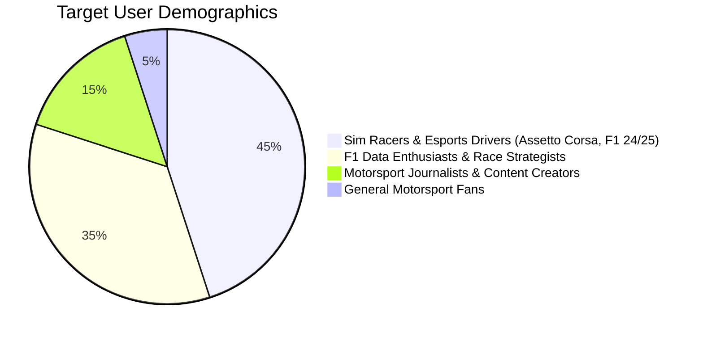
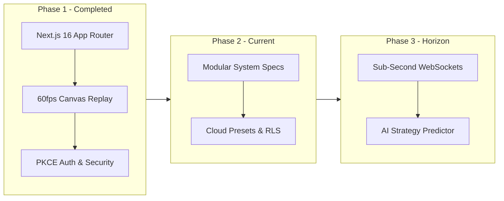

# 🏎️ Paddock Telemetry — Product Requirements Document (PRD)

| Metadata | Details |
| :--- | :--- |
| **Document ID** | `PADDOCK-PRD-001` |
| **Product Name** | Paddock Telemetry (F1 Pit-Wall Command Center) |
| **Version** | `1.0.0` (Production Baseline) |
| **Status** | Approved / Active |
| **Target Release** | 2026 Season Architecture |
| **Author** | Senior Engineering & Product Architecture Team |

---

## 1. Executive Summary

**Paddock Telemetry** is a high-performance Formula 1 reconnaissance, race replay, and pit-wall engineering command center. Built with **Next.js 16 (App Router)**, **TypeScript**, **Supabase PKCE Authentication**, and upstream telemetry engines (**FastF1** and the **Jolpica/Ergast Open Telemetry API**), Paddock provides real-time telemetry overlays, 60fps vector track canvas replays, teammate head-to-head performance deltas, and comprehensive corner-by-corner apex reconnaissance across **78 worldwide circuits** (spanning the modern 2026 calendar, historic classics, and testing grounds).

---

## 2. Problem Statement & Market Opportunity

### 2.1 The Problem
1. **Paywalled & Restricted Telemetry**: Official broadcast applications (F1 TV Pro, F1 Timing App) gate low-granularity timing behind costly recurring subscriptions without exposing raw throttle, braking, G-force, or apex speed telemetry to motorsport enthusiasts.
2. **Lack of Historic & Testing Track Coverage**: Mainstream apps only support the active ~24 Grand Prix tracks, neglecting legendary circuits (Nürburgring Nordschleife, Brands Hatch, Sepang, Kyalami, Mugello) essential for motorsport historians and sim racers.
3. **Static, Low-Fidelity Replays**: Existing fan-made tools rely on clunky, CPU-heavy rendering or static graphs rather than smooth 60fps GPU-accelerated canvas animations with interactive scrubbing and microsecond lap deltas.
4. **Poor Pit-Wall Strategy Analysis**: Fans and amateur race strategists lack unified tools to compare teammate pace consistency, tire degradation curves, and qualifying pace deltas on a single dark-mode HUD.

### 2.2 The Solution
Paddock Telemetry delivers an uncompromised, accessible, web-native command center replicating actual Formula 1 team pit-wall telemetry consoles. It empowers users with:
- Sub-millisecond teammate delta comparisons.
- High-density vector track coordinate transformation engines.
- 60fps timeline scrubbers with 1x to 10x replay playback speeds.
- Enterprise-grade authentication and session guardrails.

---

## 3. Target Audience & User Personas

### Persona A: "The Sim Racer" (Alex, 24)
- **Goal**: Analyze corner entry/apex/exit speeds, braking markers, and gear selection before tackling hot laps in sim rigs.
- **Pain Point**: Memorizing apex speeds from YouTube videos without interactive corner maps or telemetry traces.
- **Paddock Feature**: `/gallery` (78 Circuit Directory) with turn-by-turn telemetry specs and real-world apex photography.

### Persona B: "The Strategy Analyst" (Elena, 31)
- **Goal**: Evaluate how teammate strategies diverged during Sunday Grand Prix races (e.g., Ferrari vs. Red Bull tire degradation).
- **Pain Point**: Switching between multiple disparate websites to calculate lap-by-lap delta gaps and pit stop timings.
- **Paddock Feature**: `/teammates` and `/replay` with stint breakdowns, tire compound life, and position history charts.

---

## 4. Product Scope & Core Modules

| Module Route | Feature Name | Core Functionality |
| :--- | :--- | :--- |
| **`/gallery`** | **Circuit Reconnaissance** | Vector maps for 78 circuits with interactive turn selection, entry/apex/exit speeds (km/h), lateral G-forces, and verified apex photography. |
| **`/replay`** | **60fps Race Replay Engine** | Hardware-accelerated HTML5 Canvas replay with timeline scrubbing (1x–10x), driver telemetry gauges (speed, RPM, DRS, ERS), and event feeds. |
| **`/teammates`** | **H2H Rivalry Portal** | Constructor matchup comparison cards, qualifying delta curves, points progression, race-by-race tables, and reliability logs. |
| **`/lab`** | **Telemetry Overlay Lab** | High-contrast multi-driver telemetry lap overlay comparing throttle %, braking thresholds, speed traces, and gear shifts. |
| **`/tracker`** | **Live GPS Telemetry Tracker** | Real-time driver positioning along track vectors with sector splits and gap-to-leader timers. |
| **`/auth`** | **Enterprise Auth Gate** | Mandatory email verification gate, Supabase PKCE login/signup, Google OAuth 2.0 with account picker, and password recovery. |

---

## 5. Non-Functional Requirements Summary

- **Performance**: 60fps continuous render loop on HTML5 Canvas; static pages compiled in under 1 second; API responses cached for 5 minutes.
- **Design & Ergonomics**: Dark-mode high-contrast pit-wall telemetry HUD styling with team liveries and official tire compound color coding.
- **Security**: Strict Content Security Policy (no `unsafe-eval`), server-only JWT crypto, HttpOnly cookies, zero token leakage in client `localStorage`.
- **Compliance**: Fully responsive layout from 360px mobile screens to 4K ultra-wide command center monitors; WCAG AA contrast standards.

---

## 6. Success Metrics & Key Performance Indicators (KPIs)

1. **Replay Engine Fluidity**: 99% of frames rendered within a 16.6ms window (>58fps) across modern Chromium and WebKit browsers.
2. **API Latency**: Median response time `<250ms` for cached circuit geometries and `<1200ms` for cold upstream telemetry proxy calls.
3. **Session Retention**: Average user pit-wall session duration exceeding 8 minutes.
4. **Security Integrity**: 0 unauthenticated data leaks, 100% pass rate on CSRF, XSS, and credential stuffing defense audits.

---

## 7. Product Roadmap

