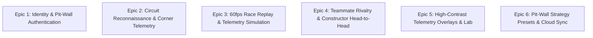

# 🏎️ Paddock Telemetry — User Stories & Acceptance Criteria

| Metadata | Details |
| :--- | :--- |
| **Document ID** | `PADDOCK-US-003` |
| **Project** | Paddock Telemetry & Pit-Wall Command Center |
| **Version** | `1.0.0` (Production Baseline) |
| **Status** | Approved / Active |
| **Methodology** | Agile / Behavior-Driven Development (BDD) |

---

## 1. Overview & Epic Hierarchy

This document translates Paddock Telemetry's core product capabilities into agile user stories accompanied by Gherkin-format acceptance criteria (`Given / When / Then`).



---

## 2. Epic 1: Identity & Pit-Wall Authentication

### US-1.1: Mandatory Email Verification Gate
> **As a** new Paddock user  
> **I want to** be required to verify my email address before accessing telemetry feeds  
> **So that** only legitimate users with verified credentials can consume serverless compute and telemetry proxies.

```gherkin
Scenario: Unconfirmed user attempts to access the telemetry dashboard
  Given a user registers with email "engineer@ferrari.it" and password "Scuderia2026!"
  When the registration request completes and Supabase returns unconfirmed status
  Then the user is redirected to the "Awaiting Email Confirmation" screen
  And all telemetry dashboards and API routes remain strictly locked
  When the user clicks the confirmation link in their email
  Then the account is flagged as confirmed and full telemetry access is granted
```

### US-1.2: Hardened Server-Side Credential Verification
> **As a** telemetry analyst  
> **I want to** authenticate securely with server-verified credentials  
> **So that** my session cannot be hijacked via malicious client-side token tampering.

```gherkin
Scenario: Successful login with valid credentials
  Given a registered user enters their email and password on the AuthGate modal
  When the form submits to "/api/auth/login"
  Then the server validates the credentials against Supabase Auth
  And issues a cryptographically signed HMAC-SHA256 HttpOnly cookie
  And the client UI transitions smoothly to the pit-wall command center
```

### US-1.3: Google Single Sign-On with Device Account Picker
> **As a** user with multiple Google accounts  
> **I want to** explicitly choose which Google account to sign in with  
> **So that** I don't accidentally authenticate with the wrong personal account.

```gherkin
Scenario: Google OAuth account selection prompt
  Given a user clicks the "Sign in with Google" button
  When the Supabase OAuth redirect initiates
  Then the OAuth URL includes "prompt=select_account+consent"
  And Google displays the multi-account chooser dialog
```

---

## 3. Epic 2: Circuit Reconnaissance & Corner Telemetry

### US-2.1: 78 Circuit Directory & Coordinate Exploration
> **As a** sim racing driver  
> **I want to** browse 78 global Formula 1 circuits (including historical and test tracks)  
> **So that** I can study track layouts and sector split locations.

```gherkin
Scenario: Navigating to a historic circuit
  Given the user visits the "/gallery" circuit directory
  When the user filters by "Historic Tracks" and selects "Brands Hatch"
  Then the 2D vector coordinate engine renders the complete circuit layout
  And shows circuit statistics: total length, turn count, and direction
```

### US-2.2: Apex Telemetry Inspection
> **As a** motorsport enthusiast  
> **I want to** click on a specific turn marker (e.g. Turn 4 at Monza)  
> **So that** I can view entry, apex, and exit speeds along with lateral G-forces.

```gherkin
Scenario: Selecting a corner apex marker
  Given the user is viewing the Monza circuit map
  When the user clicks the "Turn 4 (Variante della Roggia)" marker
  Then the corner inspector drawer slides into view
  And displays: Entry Speed (315 km/h), Apex Speed (118 km/h), Gear (2nd), Lateral G (2.8G)
  And displays verified track photography of the Turn 4 apex kerb
```

---

## 4. Epic 3: 60fps Race Replay & Telemetry Simulation

### US-3.1: GPU-Accelerated Canvas Playback
> **As a** race spectator  
> **I want to** watch a 60fps simulated race replay of any 2026 Grand Prix  
> **So that** I can follow car positions, gaps, and overtakes in real time.

```gherkin
Scenario: Smooth 60fps playback execution
  Given the user loads the "/replay" page for the Monaco Grand Prix
  When the user clicks the "Play" button or presses "Space"
  Then the HTML5 Canvas initiates a requestAnimationFrame render loop
  And renders 20 driver markers advancing along interpolated trajectory coordinates
  And maintains a continuous frame rate $\ge 58$ frames per second
```

### US-3.2: Replay Timeline Scrubbing & Variable Speeds
> **As a** pit-wall analyst  
> **I want to** scrub the replay scrubber and change playback speed between 1x, 2x, 5x, and 10x  
> **So that** I can fast-forward to critical pit stop windows or safety car restarts.

```gherkin
Scenario: Scrubbing to a safety car event
  Given the replay is actively running at 1x speed
  When the user selects "5x" speed multiplier and drags the scrubber to Lap 32
  Then the replay timeline jumps instantly to Lap 32
  And all telemetry gauges and driver positions synchronize without frame drops
```

---

## 5. Epic 4: Teammate Rivalry & Constructor Head-to-Head

### US-4.1: Qualifying Pace Delta Comparison
> **As a** Formula 1 journalist  
> **I want to** compare teammate qualifying pace deltas across a full season  
> **So that** I can determine which driver holds raw single-lap pace dominance.

```gherkin
Scenario: Comparing Ferrari teammates
  Given the user navigates to "/teammates" and selects "Scuderia Ferrari"
  When the head-to-head scorecard loads
  Then the system displays the median qualifying pace gap in milliseconds (e.g. -0.142s)
  And renders a horizontal bar chart showing qualifying battle record (e.g. 14 - 8)
```

### US-4.2: Points Progression & Position History
> **As a** motorsport analyst  
> **I want to** view cumulative points graphs and finishing positions round-by-round  
> **So that** I can assess momentum shifts and reliability DNFs throughout the season.

```gherkin
Scenario: Rendering season progression curves
  Given the user is on the teammate comparison view
  When viewing the "Points Progression" card
  Then a dual-line chart illustrates cumulative points from Round 1 to Round 24
  And interactive hover tooltips display exact points scored per Grand Prix
```

---

## 6. Epic 5: Telemetry Lab & Multi-Driver Overlays

### US-5.1: Multi-Driver Lap Trace Overlay
> **As an** amateur telemetry engineer  
> **I want to** overlay two drivers' telemetry traces (Speed, Throttle %, Brake, Gear)  
> **So that** I can pinpoint exactly where one driver gains lap time over another.

```gherkin
Scenario: Comparing pole lap telemetry traces
  Given the user visits "/lab" and selects Verstappen (Red Bull) vs Leclerc (Ferrari)
  When the user selects "Q3 Fastest Lap"
  Then synchronized speed curves appear on a shared distance-based X-axis
  And delta time indicators show micro-second advantages corner-by-corner
```

---

## 7. Epic 6: Pit-Wall Strategy Presets & Cloud Sync

### US-6.1: Saving Custom Strategy Presets to Supabase
> **As an** authenticated user  
> **I want to** save my favorite driver comparisons and circuit presets to my profile  
> **So that** I can quickly reload my pit-wall layout during race weekends.

```gherkin
Scenario: Persisting a strategy preset
  Given an authenticated user is on the telemetry comparison view
  When the user clicks "Save Strategy Preset" with name "Monza Wet Setup"
  Then an entry is created in "public.telemetry_presets" protected by RLS
  And the preset appears in the user's saved drawer across all sessions
```
