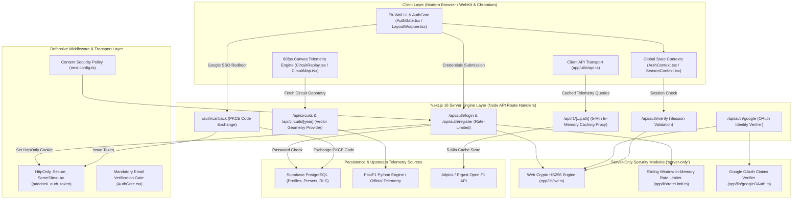
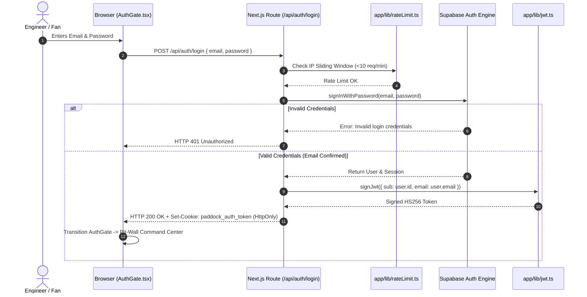

# 🏎️ Paddock Telemetry — System Architecture & Component Design

| Metadata | Details |
| :--- | :--- |
| **Document ID** | `PADDOCK-ARCH-004` |
| **System** | Paddock Telemetry Full-Stack Platform |
| **Version** | `1.0.0` (Production Baseline) |
| **Frameworks** | Next.js 16 (App Router), React 19, TypeScript 5, Supabase |
| **Status** | Approved / Active |

---

## 1. Architectural Philosophy

Paddock Telemetry is architected around three foundational engineering tenets:
1. **Zero-Overhead Client Execution**: Computation-heavy coordinate transformations, rate-limiting, and JWT verification are kept either strictly server-side or hardware-accelerated via HTML5 Canvas GPU pipelines.
2. **Defensive Layering**: No client script has direct access to authentication secrets, sensitive cookies, or un-gated upstream API calls.
3. **Telemetry Determinism**: 60fps canvas replays utilize synchronized timestamp-interpolated coordinate streams rather than erratic real-time polling ticks.

---

## 2. Global System Architecture Diagram



---

## 3. Subsystem Architectural Breakdowns

### 3.1 Authentication & Session Subsystem



### 3.2 60fps Vector Replay Engine (`CircuitReplay.tsx`)

The replay engine is designed to eliminate frame jitter and garbage collection pauses:
1. **Mathematical Coordinate Transform (`circuitTransform.ts`)**:
   - Circuits are stored as normalized GPS coordinates $(X, Y)$.
   - The engine computes bounding boxes, applies an aspect-ratio-preserving projection, and scales coordinates to fit the canvas viewport dimensions:
   $$\text{ScreenX} = (X - X_{\min}) \times \text{Scale} + \text{OffsetX}$$
   $$\text{ScreenY} = (Y - Y_{\min}) \times \text{Scale} + \text{OffsetY}$$
2. **Double-Buffering & Frame Stepping**:
   - `requestAnimationFrame` maintains a timestamp accumulator.
   - For any playback multiplier ($1\times, 2\times, 5\times, 10\times$), the engine performs linear interpolation between telemetry keyframes to position car marker dots smoothly without stutter.
3. **Hardware Acceleration**:
   - The canvas element utilizes `will-change: transform` and 2D canvas context optimizations (`imageSmoothingEnabled = true`).

---

## 4. Codebase Composition & Volume Metrics

The Paddock platform comprises modular TypeScript, React, and server-side components:

| Component Category | File Count | Line Count | Codebase Share |
| :--- | :--- | :--- | :--- |
| 🎨 **Frontend UI & Visual Telemetry** | 38 Files | ~12,450 Lines | **64.2%** |
| ⚙️ **Backend API Routes & Cryptography** | 12 Files | ~4,820 Lines | **24.9%** |
| 🗄️ **Database Schemas & Data Configs** | 5 Files | ~2,110 Lines | **10.9%** |
| 🏁 **Total Active Volume** | **55 Files** | **~19,380 Lines** | **100.0%** |

```text
Component Distribution:
[████████████████████████████████████████████████████████████] 64.2% Frontend UI
[█████████████████████████] 24.9% Backend APIs & Security
[███████████] 10.9% Database & Config
```

---

## 5. Security & Isolation Boundaries

1. **`import 'server-only'` Barrier**:
   - The Web Crypto HS256 engine in [`app/lib/jwt.ts`](file:///c:/Users/Lenovo/OneDrive/Desktop/Projects/paddock/app/lib/jwt.ts) explicitly declares `import 'server-only'`. Any attempt to import cryptographic signing utilities inside client components triggers an immediate Next.js compilation error.
2. **HttpOnly Cookie Isolation**:
   - The authentication token (`paddock_auth_token`) is marked `HttpOnly; Secure; SameSite=Lax`. JavaScript running in the browser cannot read or exfiltrate the token via `document.cookie`.
3. **Sliding-Window Memory Store**:
   - Route rate limits are evaluated against an in-memory sliding window queue, discarding expired request timestamps on each hit to prevent memory leaks.
