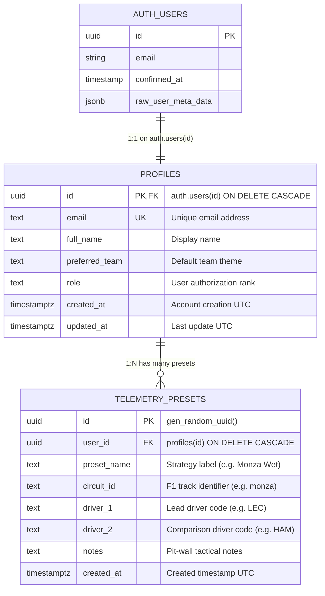

# 🏎️ Paddock Telemetry — Database Design & Schema Specification

| Metadata | Details |
| :--- | :--- |
| **Document ID** | `PADDOCK-DB-005` |
| **Database Engine** | PostgreSQL 15+ (via Supabase) |
| **Version** | `1.0.0` (Production Baseline) |
| **Status** | Approved / Active |
| **Source Schema** | [`supabase/schema.sql`](file:///c:/Users/Lenovo/OneDrive/Desktop/Projects/paddock/supabase/schema.sql) |

---

## 1. Database Overview & Security Model

Paddock Telemetry leverages **Supabase PostgreSQL** for user persistence, authorization metadata, and pit-wall strategy presets. 

The architecture strictly enforces **Row-Level Security (RLS)** across all public tables, guaranteeing that:
1. Public profiles can be read for leaderboard and author attribution, but only modified by their respective authenticated owner.
2. Telemetry strategy presets are isolated per engineer—no user can view, edit, or delete another user's saved strategy sessions.
3. System triggers handle profile creation atomically whenever a new user confirms registration in Supabase Auth.

---

## 2. Entity-Relationship Diagram (ERD)



---

## 3. Data Dictionary & Table Specifications

### 3.1 Table: `public.profiles`
Stores metadata and authorization ranks for telemetry analysts and fans.

| Column | Data Type | Constraints | Default | Description |
| :--- | :--- | :--- | :--- | :--- |
| `id` | `UUID` | `PRIMARY KEY`, `REFERENCES auth.users(id) ON DELETE CASCADE` | — | Unique user ID linked to Supabase Auth. |
| `email` | `TEXT` | `NOT NULL`, `UNIQUE` | — | User's verified email address. |
| `full_name` | `TEXT` | `NULLABLE` | — | User's chosen display name. |
| `preferred_team` | `TEXT` | `NOT NULL` | `'Scuderia Ferrari / Paddock Telemetry'` | Active constructor theme. |
| `role` | `TEXT` | `NOT NULL` | `'Registered Telemetry Analyst'` | System permissions rank. |
| `created_at` | `TIMESTAMPTZ` | `NOT NULL` | `timezone('utc'::text, now())` | Creation timestamp. |
| `updated_at` | `TIMESTAMPTZ` | `NOT NULL` | `timezone('utc'::text, now())` | Last profile update. |

### 3.2 Table: `public.telemetry_presets`
Stores saved head-to-head telemetry setups, circuit configurations, and race strategy notes.

| Column | Data Type | Constraints | Default | Description |
| :--- | :--- | :--- | :--- | :--- |
| `id` | `UUID` | `PRIMARY KEY` | `gen_random_uuid()` | Unique preset identifier. |
| `user_id` | `UUID` | `NOT NULL`, `REFERENCES public.profiles(id) ON DELETE CASCADE` | — | Preset creator. |
| `preset_name` | `TEXT` | `NOT NULL` | — | Title of saved strategy session. |
| `circuit_id` | `TEXT` | `NOT NULL` | — | Target circuit identifier. |
| `driver_1` | `TEXT` | `NOT NULL` | — | Driver 1 identifier. |
| `driver_2` | `TEXT` | `NOT NULL` | — | Driver 2 identifier. |
| `notes` | `TEXT` | `NULLABLE` | — | Engineer notes and observations. |
| `created_at` | `TIMESTAMPTZ` | `NOT NULL` | `timezone('utc'::text, now())` | Timestamp saved. |

---

## 4. Triggers & Stored Procedures

### Automated Profile Provisioning
When a user signs up via Supabase PKCE Auth, the `handle_new_user()` trigger automatically provisions their profile in the `public.profiles` table with default team metadata:

```sql
CREATE OR REPLACE FUNCTION public.handle_new_user() 
RETURNS TRIGGER AS $$
BEGIN
  INSERT INTO public.profiles (id, email, full_name, preferred_team)
  VALUES (
    new.id, 
    new.email, 
    COALESCE(new.raw_user_meta_data->>'full_name', new.email),
    COALESCE(new.raw_user_meta_data->>'preferred_team', 'Scuderia Ferrari / Paddock Telemetry')
  );
  RETURN new;
END;
$$ LANGUAGE plpgsql SECURITY DEFINER;

-- Trigger execution
DROP TRIGGER IF EXISTS on_auth_user_created ON auth.users;
CREATE TRIGGER on_auth_user_created
  AFTER INSERT ON auth.users
  FOR EACH ROW EXECUTE PROCEDURE public.handle_new_user();
```

---

## 5. Row-Level Security (RLS) Policy Specifications

### `public.profiles` RLS Rules
- **SELECT**: `CREATE POLICY "Public profiles are viewable by everyone." ON public.profiles FOR SELECT USING (true);`
- **INSERT**: `CREATE POLICY "Users can insert their own profile." ON public.profiles FOR INSERT WITH CHECK (auth.uid() = id);`
- **UPDATE**: `CREATE POLICY "Users can update own profile." ON public.profiles FOR UPDATE USING (auth.uid() = id);`

### `public.telemetry_presets` RLS Rules
- **SELECT**: `CREATE POLICY "Users can view their own telemetry presets." ON public.telemetry_presets FOR SELECT USING (auth.uid() = user_id);`
- **INSERT**: `CREATE POLICY "Users can insert their own telemetry presets." ON public.telemetry_presets FOR INSERT WITH CHECK (auth.uid() = user_id);`
- **DELETE**: `CREATE POLICY "Users can delete their own telemetry presets." ON public.telemetry_presets FOR DELETE USING (auth.uid() = user_id);`

---

## 6. Indexing & Performance Guidelines

To maintain sub-10ms query execution times as user presets scale:
```sql
-- Fast lookup of presets per engineer
CREATE INDEX IF NOT EXISTS idx_telemetry_presets_user_id 
  ON public.telemetry_presets(user_id);

-- Fast circuit-based preset filtering
CREATE INDEX IF NOT EXISTS idx_telemetry_presets_circuit 
  ON public.telemetry_presets(circuit_id);
```
