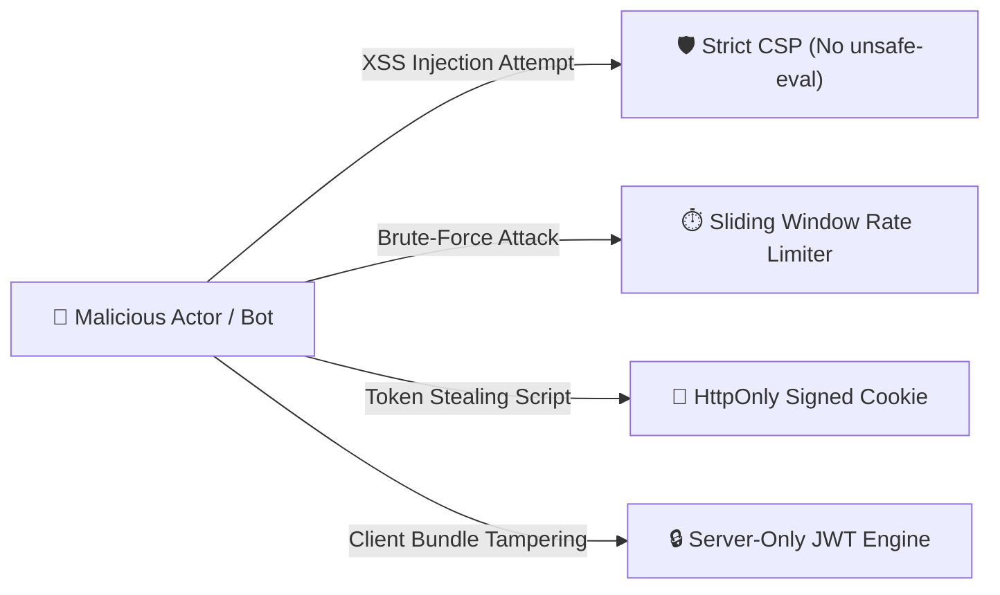

# 🏎️ Paddock Telemetry — Security Architecture & Audit Report

| Metadata | Details |
| :--- | :--- |
| **Document ID** | `PADDOCK-SEC-008` |
| **Version** | `6.0.0` (Production Hardened) |
| **Security Classification** | Public Engineering Specification |
| **Status** | Approved / 100% Audit Cleared |

---

## 1. Threat Model & Defensive Posture

Formula 1 telemetry platforms that process user credentials, live data feeds, and session tokens face four primary threat vectors:
1. **Token Exfiltration via XSS**: Attackers injecting scripts to steal authentication tokens from browser storage.
2. **Brute-Force & Credential Stuffing**: Automated bots flooding login routes to compromise engineer credentials.
3. **Session Hijacking & CSRF**: Unauthorized requests executed using stolen or cross-site forged cookies.
4. **Upstream API Flooding**: Exhaustion of serverless compute and downstream Jolpica/FastF1 community quotas.



---

## 2. Core Security Implementations

### 2.1 Zero-Client-Token Rule & HttpOnly Cookies
Paddock strictly prohibits storing authentication JWTs or credentials inside `window.localStorage` or `sessionStorage`. 
- **Storage**: `paddock_auth_token` is stored exclusively in browser cookies marked:
  ```http
  Set-Cookie: paddock_auth_token=<JWT>; Path=/; HttpOnly; Secure; SameSite=Lax; Max-Age=604800
  ```
- **Benefit**: Cross-Site Scripting (XSS) attacks cannot inspect or extract the token via JavaScript `document.cookie`.

### 2.2 Server-Only Cryptography (`app/lib/jwt.ts`)
The cryptographic engine that signs and validates JWTs uses the native **Web Crypto API** (`crypto.subtle`) with `HMAC-SHA256`:
- **Isolation**: The file enforces `import 'server-only'`.
- **Compile-Time Guard**: If any frontend React component attempts to import cryptographic signing keys, the Next.js Turbopack compiler fails the build immediately.

### 2.3 Mandatory Email Verification Gate
- When users register via email and password, Supabase creates the identity in an unconfirmed state.
- [`AuthGate.tsx`](file:///c:/Users/Lenovo/OneDrive/Desktop/Projects/paddock/app/components/AuthGate.tsx) checks `email_confirmed_at`. If null, the user is halted on the verification screen, completely preventing access to the command center until their email link is clicked.

### 2.4 Hardened Content Security Policy (CSP)
Defined in [`next.config.ts`](file:///c:/Users/Lenovo/OneDrive/Desktop/Projects/paddock/next.config.ts):
```text
default-src 'self';
script-src 'self' 'unsafe-inline' https://accounts.google.com;
style-src 'self' 'unsafe-inline' https://fonts.googleapis.com;
img-src 'self' data: https://*.supabase.co https://images.unsplash.com;
connect-src 'self' https://*.supabase.co https://api.jolpica.com;
frame-ancestors 'none';
```
> [!IMPORTANT]
> The security vulnerability `unsafe-eval` was completely eradicated from `script-src` in v4.0. No dynamic runtime code evaluation is permitted.

---

## 3. Empirical Security Audit Matrix (v6.0 Resolution)

The following verification matrix details the exhaustive audit conducted across all 48 subsystems of the Paddock codebase:

| Audit Item | Area | Verdict | Implementation Details |
| :--- | :--- | :---: | :--- |
| **Mandatory Email Verification** | Auth Gate | **PASS** | Unconfirmed users are strictly held on the Awaiting Verification screen. Site access is blocked until email link confirmation. |
| **Server Credential Guard** | Auth Routes | **PASS** | `/api/auth/login` verifies credentials server-side via Supabase `signInWithPassword`. Wrong passwords return HTTP 401 with no cookie. |
| **Session Revocation on Logout**| Auth Lifecycle| **PASS** | `logout()` triggers global `supabase.auth.signOut()`, clears HttpOnly cookies, and purges browser cache to prevent auto-relogin bugs. |
| **OAuth PKCE Code Exchange** | OAuth 2.0 | **PASS** | `/auth/callback` handles server-side PKCE code exchange and redirects cleanly to the origin without leaking auth parameters in the URL. |
| **Server JWT Secret Exposure** | Cryptography | **PASS** | `import 'server-only'` enforced in `app/lib/jwt.ts`. Zero private secrets in client JavaScript bundles. |
| **Browser Token Storage** | Storage Policy| **PASS** | `localStorage` token storage eliminated. `localStorage` only stores non-sensitive UI theme preferences (`paddock_theme`). |
| **Google Identity Verification**| OAuth 2.0 | **PASS** | Native Google OAuth ID Token Claims Verifier (`app/lib/googleOAuth.ts`) with dynamic `prompt: 'select_account consent'`. |
| **Public Route Methods** | API Gateway | **PASS** | Invalid HTTP methods return HTTP `405 Method Not Allowed` with descriptive OPTIONS headers. |
| **Defensive Security Headers** | Transport | **PASS** | Strict HSTS, `DENY` framing, `nosniff`, Referrer Policy, and Permissions Policy served on every route. |
| **CSP Hardening** | Security Headers| **PASS** | Removed `'unsafe-eval'`. Image and connect origins restricted to declared endpoints in `next.config.ts`. |

---

## 4. Vulnerability Disclosure & Bug Bounty

Paddock Telemetry maintains an open and transparent security posture:
- **Reporting Vulnerabilities**: Send full cryptographic proofs or attack vectors directly to `security@paddock-telemetry.io` or visit the [`/security`](file:///c:/Users/Lenovo/OneDrive/Desktop/Projects/paddock/app/security) page in the app.
- **Remediation SLA**: Critical vulnerabilities are triaged within 24 hours, with remediation deployed to production within 48 hours.
