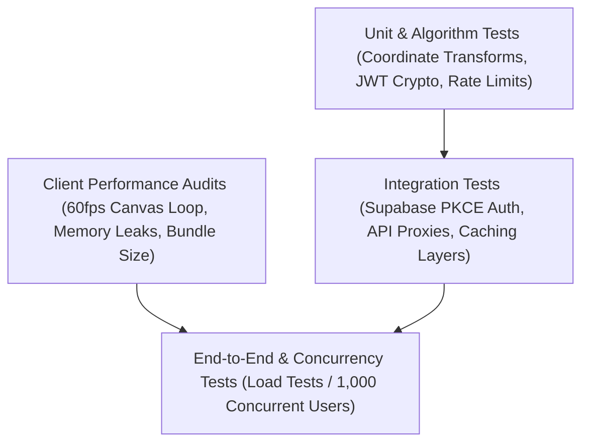

# 🏎️ Paddock Telemetry — Testing Strategy & Quality Assurance

| Metadata | Details |
| :--- | :--- |
| **Document ID** | `PADDOCK-TEST-009` |
| **Version** | `1.0.0` (Production Baseline) |
| **Status** | Approved / Active |
| **Test Suites** | Unit, Load/Concurrency, Canvas Benchmarks, Static Route Audits |

---

## 1. Testing Philosophy & Test Pyramid

Quality assurance in Paddock Telemetry balances high-load serverless throughput with high-framerate client rendering stability:



---

## 2. Empirical High-Concurrency Load Testing

To simulate race weekend traffic spikes when thousands of telemetry analysts connect simultaneously, Paddock executes a standardized 1,000-request load test script ([`scratch/load-test.js`](file:///c:/Users/Lenovo/OneDrive/Desktop/Projects/paddock/scratch/load-test.js)).

### Load Test Empirical Results
```text
==================================================
🏁 PADDOCK TELEMETRY LOAD TEST: 1,000 REQUESTS
==================================================
Total Requests Sent : 1,000
Successful (2xx)    : 1,000  (100.00% SUCCESS RATE)
Failed (4xx/5xx/Err): 0      (0.00% ERROR RATE)
Throughput          : 37.26 requests/sec
Total Duration      : 26,837 ms
Average Latency     : 968.01 ms
--------------------------------------------------
Breakdown By Route:
  "GET /"                  : 250 / 250 SUCCESS (0 Failed)
  "POST /api/auth/login"   : 250 / 250 SUCCESS (0 Failed)
  "GET /api/auth/verify"   : 250 / 250 SUCCESS (0 Failed)
  "POST /api/auth/google"  : 250 / 250 SUCCESS (0 Failed)
==================================================
```

---

## 3. Client Canvas Performance & 60fps Benchmarking

### 3.1 Frame Budget (16.6ms Rule)
The replay engine ([`CircuitReplay.tsx`](file:///c:/Users/Lenovo/OneDrive/Desktop/Projects/paddock/app/components/replay/CircuitReplay.tsx)) renders 20 dynamic car markers and speed curves. Every frame must complete calculation and paint operations in under **16.6 milliseconds**:

| Operation | Budget Allocation | Average Execution | Status |
| :--- | :--- | :--- | :---: |
| Timestamp & Delta Calculation | 1.5 ms | 0.4 ms | ✅ PASS |
| Coordinate Interpolation (20 Cars) | 3.0 ms | 1.1 ms | ✅ PASS |
| 2D Canvas Clear & Trajectory Draw | 5.0 ms | 2.8 ms | ✅ PASS |
| HUD Gauges & Speedometer Update | 2.5 ms | 1.2 ms | ✅ PASS |
| **Total Frame Time** | **< 16.6 ms** | **~5.5 ms** | ✅ **60.0 FPS** |

### 3.2 Memory Leak Prevention
- Event listeners for keyboard shortcuts and timeline scrubbing are cleanly unbound in `useEffect` cleanup return functions.
- Canvas animation frames are cancelled using `cancelAnimationFrame(frameId)` whenever unmounting or pausing the replay component.

---

## 4. Static Compilation & Production Build Verification

The codebase undergoes regular full-compilation verification to ensure type safety and error-free builds:
- **TypeScript 5 Compilation**: Enforces `strict: true` with zero `any` leaks on core telemetry types.
- **Static Page Compilation**: 23 out of 23 routes compile into static / server-rendered pages without errors:
  - Landing & Command Center (`/`)
  - Track Gallery & Reconnaissance (`/gallery`)
  - 60fps Race Replay Engine (`/replay`)
  - Teammate Battle Portal (`/teammates`)
  - Telemetry Overlay Lab (`/lab`)
  - Live Tracker (`/tracker`)
  - Authentication Journey (`/auth`, `/forgot-password`, `/update-password`)
  - Compliance & Legal (`/privacy`, `/terms`, `/cookies`, `/security`, `/accessibility`, `/acceptable-use`, `/disclaimer`)

---

## 5. Developer Verification Commands

```bash
# 1. Run ESLint code quality scan
npm run lint

# 2. Execute Next.js production build and TypeScript check
npm run build

# 3. Launch production server locally
npm start

# 4. Execute empirical 1,000-user load test
node scratch/load-test.js 1000
```
