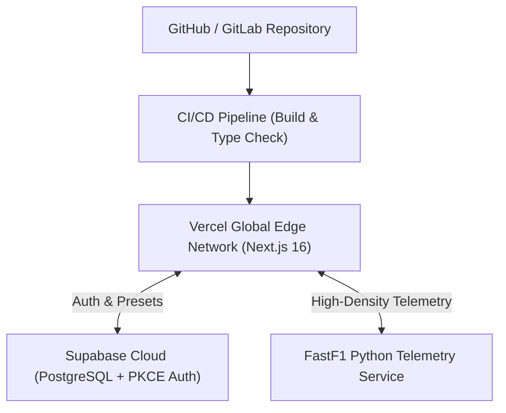

# 🏎️ Paddock Telemetry — Deployment & Operations Guide

| Metadata | Details |
| :--- | :--- |
| **Document ID** | `PADDOCK-OPS-010` |
| **Version** | `1.0.0` (Production Baseline) |
| **Target Runtime** | Node.js 20+ / Vercel Edge & Serverless / Supabase |
| **Status** | Approved / Active |

---

## 1. Hosting Architecture Overview

Paddock Telemetry is architected for low-latency serverless edge deployment:
- **Frontend & Route Handlers**: Deployed on **Vercel** or any standalone Node.js 20+ host using Next.js 16 Turbopack.
- **Persistence & Auth Layer**: Managed **Supabase** instance running PostgreSQL with RLS and PKCE OAuth services.
- **Telemetry Upstream**: Jolpica/Ergast API cached via Next.js in-memory proxy, complemented by an asynchronous FastF1 Python telemetry worker.



---

## 2. Environment Variables Configuration

Create a `.env.local` file in the project root based on the following matrix:

| Variable | Environment | Required | Description |
| :--- | :--- | :---: | :--- |
| `NEXT_PUBLIC_SUPABASE_URL` | Client & Server | **YES** | Supabase project URL (`https://<project-ref>.supabase.co`). |
| `NEXT_PUBLIC_SUPABASE_ANON_KEY` | Client & Server | **YES** | Supabase public anonymous API key. |
| `SUPABASE_SERVICE_ROLE_KEY` | Server Only | **YES** | Admin service role key for backend authentication. |
| `JWT_SECRET` | Server Only | **YES** | High-entropy 256-bit secret string for HS256 JWT signing. |
| `NEXT_PUBLIC_GOOGLE_CLIENT_ID` | Client & Server | **OPTIONAL** | Google OAuth 2.0 Web Client ID. |
| `GOOGLE_CLIENT_SECRET` | Server Only | **OPTIONAL** | Google OAuth 2.0 Client Secret. |
| `FASTF1_BACKEND_URL` | Server Only | **OPTIONAL** | URL of dedicated FastF1 Python telemetry ingestion worker. |
| `NODE_ENV` | System | **YES** | Set to `production` in production hosting environments. |

> [!CAUTION]
> Never prefix private keys (`SUPABASE_SERVICE_ROLE_KEY`, `JWT_SECRET`) with `NEXT_PUBLIC_`. Private keys must never be exposed to browser JavaScript bundles.

---

## 3. Step-by-Step Production Deployment

### 3.1 Vercel Deployment (Recommended)
1. **Connect Repository**: Link the GitHub repository in the Vercel Dashboard.
2. **Framework Preset**: Select **Next.js**.
3. **Build & Output Settings**:
   - Build Command: `next build`
   - Output Directory: `.next`
   - Install Command: `npm install`
4. **Environment Variables**: Add all required keys from Section 2 into the Vercel Project Settings.
5. **Trigger Deploy**: Click **Deploy**. Vercel will compile static assets and configure Edge/Serverless Route Handlers.

### 3.2 Supabase Database Setup
1. Open your Supabase SQL Editor.
2. Paste and execute the contents of [`supabase/schema.sql`](file:///c:/Users/Lenovo/OneDrive/Desktop/Projects/paddock/supabase/schema.sql).
3. In **Authentication -> URL Configuration**:
   - Set **Site URL**: `https://your-domain.vercel.app`
   - Add **Redirect URL**: `https://your-domain.vercel.app/auth/callback`
   - Add **Redirect URL**: `https://your-domain.vercel.app/update-password`

---

## 4. Standalone Docker Deployment

For self-hosted Linux servers (AWS ECS, Google Cloud Run, DigitalOcean):

```dockerfile
# Multi-stage Dockerfile for Next.js 16 Standalone
FROM node:20-alpine AS base

FROM base AS deps
WORKDIR /app
COPY package.json package-lock.json ./
RUN npm ci

FROM base AS builder
WORKDIR /app
COPY --from=deps /app/node_modules ./node_modules
COPY . .
ENV NEXT_TELEMETRY_DISABLED=1
RUN npm run build

FROM base AS runner
WORKDIR /app
ENV NODE_ENV=production
ENV PORT=3000
COPY --from=builder /app/public ./public
COPY --from=builder /app/.next/standalone ./
COPY --from=builder /app/.next/static ./.next/static

EXPOSE 3000
CMD ["node", "server.js"]
```

---

## 5. Post-Deployment Verification & Smoke Tests

After deploying a new release, execute the following smoke checks:
1. **Health Verification**: Load `https://your-domain.vercel.app` and confirm initial bundle loads in `<1.5s`.
2. **Auth Verification**: Register a test account and verify email confirmation redirect to `/auth/callback`.
3. **Canvas Engine**: Visit `/replay` and verify 60fps vector track animation runs smoothly.
4. **Load Test**: Run `node scratch/load-test.js 250` against the production domain to verify response latency and rate limiting.
